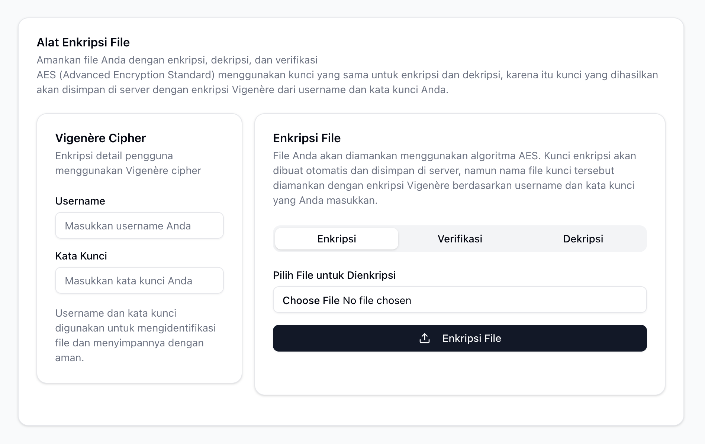

# CypherFile: Alat Enkripsi & Verifikasi File Aman



**CypherFile** adalah aplikasi web full-stack yang dirancang untuk menyediakan alat yang mudah digunakan untuk mengenkripsi, mendekripsi, dan memverifikasi integritas file. Aplikasi ini menggabungkan keamanan enkripsi simetris **AES** dengan metode **Vigenère Cipher** untuk mengelola kunci secara unik untuk setiap pengguna dan file.

Dibangun dengan **Next.js** di frontend dan **FastAPI (Python)** di backend, serta dikemas dengan **Docker** untuk kemudahan deployment dan skalabilitas.

## Daftar Isi

- [Fitur Utama](#fitur-utama)
- [Bagaimana Aplikasi Bekerja](#bagaimana-aplikasi-bekerja)
  - [Arsitektur Umum](#arsitektur-umum)
  - [Alur Kerja Enkripsi](#alur-kerja-enkripsi)
  - [Alur Kerja Dekripsi](#alur-kerja-dekripsi)
  - [Alur Kerja Verifikasi](#alur-kerja-verifikasi)
- [Teknologi yang Digunakan](#teknologi-yang-digunakan)
- [Prasyarat](#prasyarat)
- [Instalasi dan Menjalankan Aplikasi](#instalasi-dan-menjalankan-aplikasi)
- [Struktur Proyek](#struktur-proyek)
- [Dokumentasi API](#dokumentasi-api)
  - [Encrypt File](#encrypt-file)
  - [Decrypt File](#decrypt-file)
  - [Verify File](#verify-file)
- [Potensi Peningkatan](#potensi-peningkatan)

## Fitur Utama

-   **Enkripsi File**: Mengamankan file apa pun menggunakan enkripsi **AES-128-CBC** yang kuat dari library `cryptography.fernet`.
-   **Dekripsi File**: Membuka kembali file yang terenkripsi dengan aman menggunakan kredensial yang sama.
-   **Verifikasi Integritas**: Memastikan file tidak dimodifikasi atau rusak sejak dienkripsi dengan membandingkan hash **SHA-256**.
-   **Manajemen Kunci Unik**: Menggabungkan **username** dan **kata kunci** pengguna untuk membuat nama file kunci yang unik melalui **Vigenère Cipher**, menambahkan lapisan keamanan ekstra untuk penyimpanan kunci di server.
-   **Antarmuka Modern**: UI yang bersih dan responsif dibangun dengan Next.js, TypeScript, dan Shadcn UI.
-   **Siap Produksi**: Dikemas dalam kontainer Docker untuk kemudahan deployment dan isolasi lingkungan.

## Bagaimana Aplikasi Bekerja

### Arsitektur Umum

Aplikasi ini menggunakan arsitektur dua tingkat (two-tier) yang terpisah antara frontend dan backend, yang diatur oleh Docker Compose.

1.  **Frontend (`frontend` service)**:
    -   Dibangun dengan **Next.js** dan **React**.
    -   Bertanggung jawab untuk menyajikan antarmuka pengguna (UI).
    -   Mengelola interaksi pengguna, seperti upload file dan input form.
    -   Mengirim permintaan API ke backend menggunakan **Axios**.
    -   Konfigurasi di `next.config.ts` melakukan *rewrite* (proxy) untuk semua permintaan ke `/api/*` agar diteruskan ke layanan backend (`http://backend:8000/api/*`), sehingga komunikasi antar-kontainer menjadi mulus.

2.  **Backend (`backend` service)**:
    -   Dibangun dengan **FastAPI (Python)**.
    -   Menyediakan REST API untuk operasi file (enkripsi, dekripsi, verifikasi).
    -   Melakukan semua logika kriptografi.
    -   Menyimpan file-file sementara, kunci enkripsi, dan hash di dalam direktori `storage` di dalam kontainer. File-file ini bersifat sementara atau persisten tergantung pada konfigurasinya (dalam kasus ini, volume mount `./python-api:/app` membuat `storage` ada di host machine juga).

### Alur Kerja Enkripsi

Ketika pengguna ingin mengenkripsi file:

1.  **Input Pengguna**: Pengguna memasukkan `username`, `kata kunci`, dan memilih sebuah file di UI.
2.  **Pembuatan Kunci Pengguna**: Backend menerima data tersebut. `username` dienkripsi menggunakan `kata kunci` sebagai *key* dalam **Vigenère Cipher**. Hasilnya adalah `user_key` yang unik, contoh: `username: "alice"`, `keyword: "secret"` -> `user_key: "KVOOE"`.
3.  **Penamaan File Unik**: Nama file asli digabungkan dengan `user_key` untuk membuat nama file basis yang unik di server, contoh: `KVOOE_document.pdf`.
4.  **Pembuatan Kunci AES**:
    -   Backend memeriksa apakah ada file kunci bernama `KVOOE_document.pdf.key` di direktori `storage`.
    -   Jika tidak ada, sebuah kunci **AES** yang aman dan acak dibuat menggunakan `Fernet.generate_key()` dan disimpan sebagai `storage/KVOOE_document.pdf.key`.
5.  **Enkripsi File**:
    -   File asli yang di-upload dibaca.
    -   Konten file dienkripsi menggunakan kunci AES yang baru saja dibuat/dimuat.
    -   Hasil enkripsi disimpan sementara sebagai `storage/KVOOE_document.pdf.enc`.
6.  **Pembuatan Hash**:
    -   Hash **SHA-256** dihitung dari **file asli** (sebelum dienkripsi).
    -   Hash ini disimpan dalam file teks bernama `storage/KVOOE_document.pdf.hash`. Ini akan digunakan untuk verifikasi nanti.
7.  **Respons ke Pengguna**: File terenkripsi (`.enc`) dikirim kembali ke frontend, yang kemudian menawarkannya sebagai file unduhan kepada pengguna.
8.  **Pembersihan**: File asli dan file terenkripsi sementara di server dihapus menggunakan `BackgroundTasks` FastAPI setelah respons dikirim. File `.key` dan `.hash` tetap disimpan di server untuk proses dekripsi dan verifikasi di masa mendatang.

### Alur Kerja Dekripsi

1.  **Input Pengguna**: Pengguna memasukkan `username` dan `kata kunci` yang sama seperti saat enkripsi, lalu meng-upload file terenkripsi (`.enc`).
2.  **Identifikasi Kunci**: Backend kembali membuat `user_key` dari `username` dan `kata kunci` menggunakan Vigenère Cipher.
3.  **Pencarian Kunci AES**: Backend mencari file kunci yang sesuai, yaitu `storage/<user_key>_<original_filename>.key`. Jika file kunci ini tidak ditemukan, proses gagal (artinya username/kata kunci salah atau file tersebut belum pernah dienkripsi dengan kombinasi ini).
4.  **Dekripsi File**:
    -   Kunci AES dari file `.key` dimuat.
    -   Konten file `.enc` yang di-upload didekripsi menggunakan kunci tersebut.
    -   Hasil dekripsi (file asli) disimpan sementara.
5.  **Respons ke Pengguna**: File yang telah didekripsi dikirim kembali ke frontend untuk diunduh pengguna.
6.  **Pembersihan**: File terenkripsi dan file hasil dekripsi sementara di server dihapus.

### Alur Kerja Verifikasi

1.  **Input Pengguna**: Pengguna memasukkan `username` dan `kata kunci`, lalu meng-upload file **asli** (bukan yang terenkripsi).
2.  **Identifikasi Hash**: Backend membuat `user_key` dan mencari file hash yang sesuai, yaitu `storage/<user_key>_<original_filename>.hash`.
3.  **Perhitungan Hash**: Hash SHA-256 dihitung dari file yang baru saja di-upload oleh pengguna.
4.  **Perbandingan**: Hash yang baru dihitung dibandingkan dengan hash yang tersimpan di file `.hash`.
5.  **Respons ke Pengguna**: Backend mengirim pesan sukses jika hash cocok, atau pesan gagal jika tidak, yang kemudian ditampilkan di UI.

## Teknologi yang Digunakan

| Kategori          | Teknologi                                                                                                        |
| ----------------- | ---------------------------------------------------------------------------------------------------------------- |
| **Container**     | [Docker](https://www.docker.com/), [Docker Compose](https://docs.docker.com/compose/)                             |
| **Frontend**      | [Next.js 15](https://nextjs.org/), [React 19](https://react.dev/), [TypeScript](https://www.typescriptlang.org/)   |
| **Backend**       | [Python 3.11](https://www.python.org/), [FastAPI](https://fastapi.tiangolo.com/), [Uvicorn](https://www.uvicorn.org/) |
| **Styling & UI**  | [Tailwind CSS 4](https://tailwindcss.com/), [Shadcn UI](https://ui.shadcn.com/), [Lucide Icons](https://lucide.dev/) |
| **Kriptografi**   | `cryptography` (untuk AES/Fernet), `hashlib` (untuk SHA-256)                                                       |
| **HTTP Client**   | [Axios](https://axios-http.com/)                                                                                 |

## Prasyarat

Sebelum memulai, pastikan Anda telah menginstal perangkat lunak berikut di sistem Anda:

-   [**Docker**](https://docs.docker.com/get-docker/)
-   [**Docker Compose**](https://docs.docker.com/compose/install/) (biasanya sudah termasuk dalam Docker Desktop)

## Instalasi dan Menjalankan Aplikasi

Ikuti langkah-langkah ini untuk menjalankan aplikasi di lingkungan lokal Anda.

1.  **Clone Repositori**

    Buka terminal Anda dan clone repositori ini:

    ```bash
    git clone https://github.com/tantowijh/cypher-file.git
    cd cypher-file
    ```

2.  **Jalankan dengan Docker Compose**

    Dari direktori root proyek (`cypher-file/`), jalankan perintah berikut:

    ```bash
    docker-compose up --build
    ```

    -   `--build`: Perintah ini akan memaksa Docker untuk membangun image dari awal berdasarkan `Dockerfile` di direktori `nextjs-app` dan `python-api`. Ini hanya perlu dilakukan saat pertama kali atau jika ada perubahan pada `Dockerfile` atau dependensi (`package.json`, `requirements.txt`).
    -   `up`: Perintah ini akan membuat dan menjalankan kontainer untuk layanan `frontend` dan `backend` seperti yang didefinisikan di `docker-compose.yaml`.

3.  **Akses Aplikasi**

    Setelah kontainer berhasil berjalan, Anda akan melihat log dari kedua layanan di terminal. Buka browser web Anda dan navigasikan ke:

    **`http://localhost:3000`**

4.  **Menghentikan Aplikasi**

    Untuk menghentikan semua kontainer yang sedang berjalan, tekan `Ctrl + C` di terminal tempat Anda menjalankan `docker-compose up`. Untuk menghapus kontainer dan jaringan yang dibuat, jalankan:

    ```bash
    docker-compose down
    ```

## Struktur Proyek

```
cypher-file/
├── docker-compose.yaml         # Mendefinisikan dan mengorkestrasi layanan aplikasi
├── nextjs-app/                 # Direktori untuk aplikasi frontend Next.js
│   ├── Dockerfile              # Instruksi untuk membangun image frontend
│   ├── next.config.ts          # Konfigurasi Next.js, termasuk proxy API
│   ├── package.json            # Dependensi dan skrip frontend
│   ├── tsconfig.json           # Konfigurasi TypeScript
│   └── src/
│       └── app/
│           ├── page.tsx        # Halaman utama aplikasi (UI)
│           ├── layout.tsx      # Layout root
│           └── globals.css     # Styling global
├── python-api/                 # Direktori untuk aplikasi backend FastAPI
│   ├── Dockerfile              # Instruksi untuk membangun image backend
│   ├── requirements.txt        # Dependensi Python
│   ├── main.py                 # Titik masuk aplikasi FastAPI & CORS
│   └── file.py                 # Router API dan logika kriptografi
└── README.md                   # Anda sedang membaca ini
```

## Dokumentasi API

Semua endpoint API diakses melalui prefiks `/api`.

### Encrypt File

-   **Endpoint**: `POST /api/file/encrypt`
-   **Deskripsi**: Menerima sebuah file, mengenkripsinya, dan mengembalikan file terenkripsi.
-   **Request Body**: `multipart/form-data`
    -   `file`: File yang akan dienkripsi.
    -   `username`: (string) Username pengguna.
    -   `keyword`: (string) Kata kunci untuk Vigenère cipher.
-   **Response**:
    -   `200 OK`: `application/octet-stream` dengan file terenkripsi (`.enc`). Header `Content-Disposition` berisi nama file yang disarankan.
    -   `500 Internal Server Error`: Jika terjadi kesalahan selama proses enkripsi.

### Decrypt File

-   **Endpoint**: `POST /api/file/decrypt`
-   **Deskripsi**: Menerima file terenkripsi, mendekripsinya, dan mengembalikan file asli.
-   **Request Body**: `multipart/form-data`
    -   `file`: File terenkripsi (`.enc`) yang akan didekripsi.
    -   `username`: (string) Username yang sama dengan saat enkripsi.
    -   `keyword`: (string) Kata kunci yang sama dengan saat enkripsi.
-   **Response**:
    -   `200 OK`: `application/octet-stream` dengan file yang telah didekripsi.
    -   `404 Not Found`: Jika kunci dekripsi tidak ditemukan.
    -   `500 Internal Server Error`: Jika terjadi kesalahan (misalnya, token tidak valid karena kunci salah).

### Verify File

-   **Endpoint**: `POST /api/file/verify`
-   **Deskripsi**: Memverifikasi integritas file dengan membandingkan hash-nya dengan yang tersimpan.
-   **Request Body**: `multipart/form-data`
    -   `file`: File **asli** yang akan diverifikasi.
    -   `username`: (string) Username yang digunakan saat enkripsi.
    -   `keyword`: (string) Kata kunci yang digunakan saat enkripsi.
-   **Response**:
    -   `200 OK`: `application/json` dengan pesan `{ "message": "Integritas file berhasil diverifikasi" }` atau `{ "message": "Verifikasi integritas file gagal" }`.
    -   `400 Bad Request`: Jika file hash tidak ditemukan.

## Potensi Peningkatan

-   **Autentikasi Pengguna**: Mengimplementasikan sistem login yang sebenarnya untuk mengelola akses.
-   **Penyimpanan Cloud**: Mengintegrasikan penyimpanan file dengan layanan seperti Amazon S3 atau Google Cloud Storage agar file `.key` dan `.hash` lebih persisten dan aman.
-   **Streaming**: Untuk file berukuran besar, implementasikan streaming untuk enkripsi/dekripsi agar tidak membebani memori server.
-   **Keamanan Lanjutan**: Menggunakan metode manajemen kunci yang lebih canggih seperti KDF (Key Derivation Function) (misalnya, PBKDF2 atau Argon2) untuk menghasilkan kunci dari kata kunci, daripada Vigenère Cipher.
-   **Error Handling**: Memberikan pesan error yang lebih deskriptif dan spesifik di frontend.
